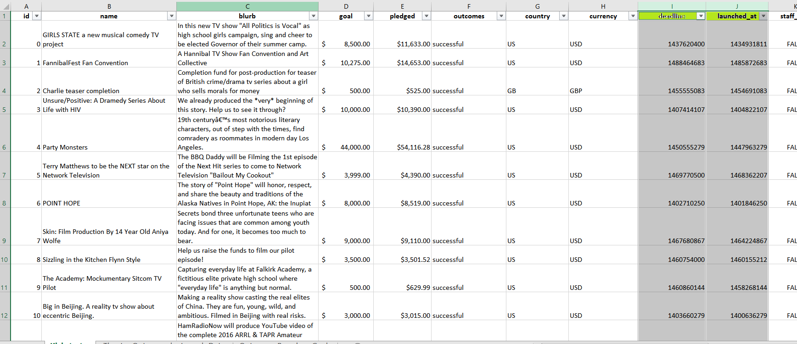
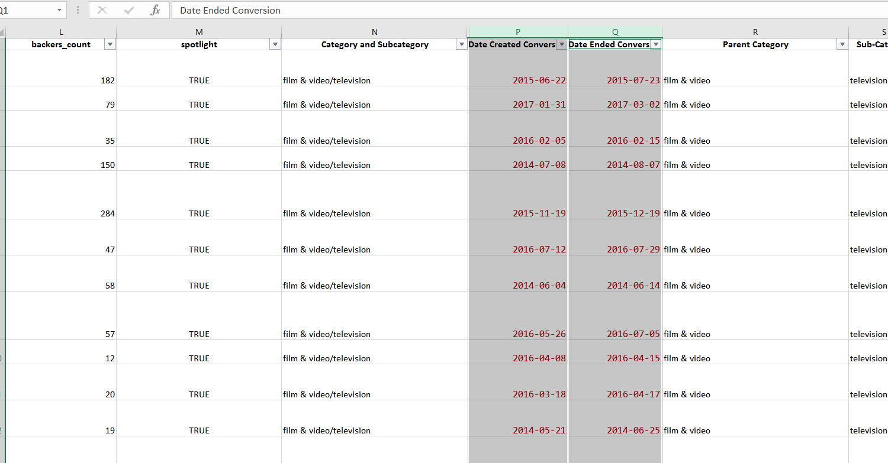
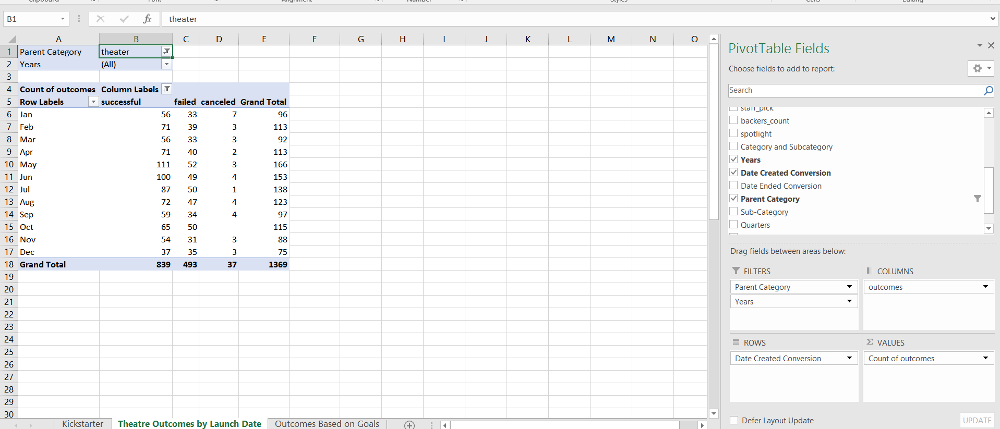
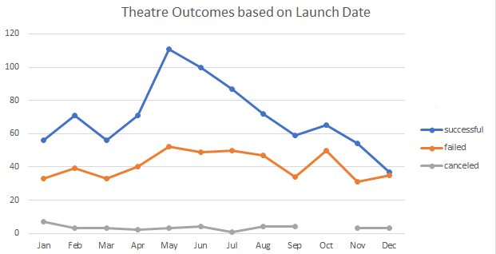
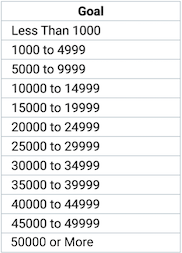
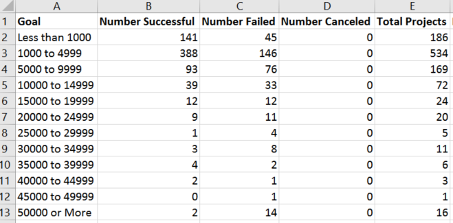
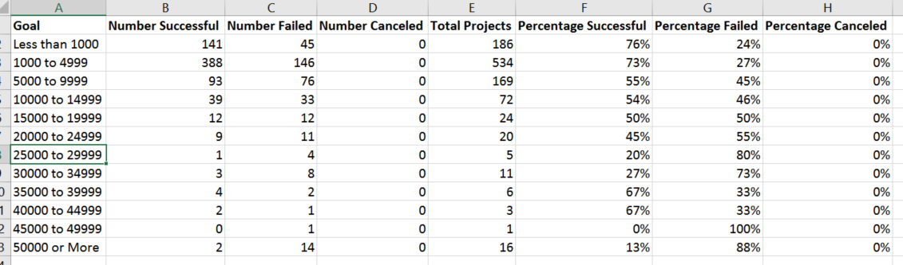
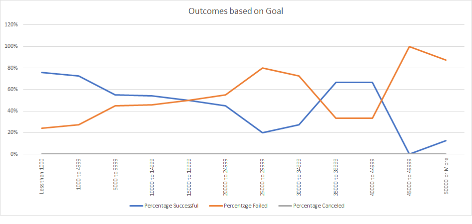

# Written Analysis: Kickstarting with Excel
> Perform data analysis on Kickstarter data.

## Table of Contents
* [Overview of the project](#overview-of-the-project)
* [Purpose](#purpose)
* [Analyis and Challenges](#analysis-and-challenges)
* [First steps](#first-steps)
* [The ask for the analysis](#the-ask-for-the-analysis)
* [Ask 1: Analysis of theatre outcomes based on launch dates](#ask-1:-analysis-of-theatre-outcomes-based-on-launch-date)
* [Ask 2: Analysis of the percentage of outcomes based on funding goal amounts](#ask-2:-analysis-of-the-percentage-of-outcomes-based-on-funding-goal-amounts)
* [Challenges Encountered](#challenges-encountered)
* [Results](#results)

## Overview of the project
This challenge is to perform data analysis on over 4110 crowdfunding projects between 2009 and 2017, to uncover trends related to theatre. 
### Purpose
Using a Kickstarter Database, that contains a list of various real world data points such as, lifestyle categories, its launch dates, funding goals and its subsequent outcomes, the purpose of this analysis is to offer insights on how these campaigns, specific to plays, work and how they fared in relation to their launch dates and funding goals, to ensure the success of Louise’s crowdfunding play Fever. The results of this analysis will allow Louise to set realistic fundraising goals, in order to plan for a successful campaign.

## Analysis and Challenges

### First steps
Prior to diving into the analysis, the first step is to familiarize with the data type in question and organize the data and its values based on the ask of the project.
Considering the focus on theatre projects, specifically plays, the Kickstarter dataset needs to be structured by breaking down the “Category and Subcategory” column N, into two new distinct columns – “Parent Category” (column R) – that contains Theatre (the subject of concern) and “Sub-Category” (column S) – that separates out its subsequent branches such as plays, musical and spaces and so on.

### The ask for the analysis
As mentioned in the overview, Louise requires two data points for setting her fundraising goals:
1. Month over month analysis of successful, failed and cancelled outcomes based on the launch dates of the Theatre campaigns, keeping a focus on the plays only.
2. Analysis of the percentage of successful, failed and cancelled outcomes based on the funding goal amounts, of the Theatre campaigns, focusing on plays.
The results of the asks would allow Louise to visualise a summary of the data to clearly identify if certain time of the year is trending to be more successful than the other and also compare the success rates of the plays under each fundraising goal range.

### Ask 1: Analysis of theatre outcomes based on launch dates
In order to begin analysis based on the launch dates, I was first required to identify the actual dates on the Kickstarter worksheet. When looking at the dataset, it is identified that the columns “deadline” (column I) and “launched_at” (column J) are in a Unix timestamp format and in order to conduct the analysis, the values in these columns need to be converted into a readable format showing day-month-year.

 
To further organize the data in these columns, I created a new column “Date created conversion” (column P) and “Date Ended Conversion” (column Q) to convert the Unix formatting into “yyyy-mm-dd” short date format. The following formula was used to make this conversion 

`=(((J2/60)/60)/24)+DATE(1970,1,1)` 
`=(((I2/60)/60)/24)+DATE(1970,1,1)`

After this, the Kickstarter dataset needed to be organized by creating a “Years” column O, to extract the year from the “Date created conversion” column, that in turn allows for more clarity into the timeframes of the launch of a particular campaign. The following formula was used to extract the year for each campaign: 
`=YEAR(P2)` 
where P2 refers to the first cell that contains a value under date created conversion column. 
To further complete this analysis, I created a pivot table, using the entire data set from the Kickstarter worksheet and customised the fields to include, “Parent category” and “Years” as filters, “date created conversion” as rows and “outcomes” as columns and values. After setting up these fields, the pivot table was further filtered by removing the outcomes of live campaigns, the rows were modified to only show the months of the year by dragging and dropping the years and quarters to the spreadsheet to remove them from the pivot table fields and finally filtered the parent category to show data for “theatre” only.

To allow for easy visualisation of the relationship between the outcomes and the launch month, a line chart was then created using the data on pivot table. 

### Ask 2: Analysis of the percentage of outcomes based on funding goal amounts
As the title suggests, the focus of this section of the analysis is to identify and compare the percentage of successful, canceled and failed plays based on the funding goal amounts. In order to move forward, the funding goal amounts were grouped in ranges of certain dollar values. A new column on a new worksheet was created that incorporated 12 different ranges of the goal amount, starting from less than $1000 up to anything greater than $50,000. These ranges accounted for all the goal amounts associated to the campaigns listed on the original Kickstarter worksheet.

The COUNTIFS function returns the counts of cells that meet one or more criteria and can be applied to more than one condition at the same time. Considering we needed to identify the outcomes, based on the goal amounts and to reference the set ranges of the goal amounts for just the plays sub category, I used the COUNTIFS function, to get the values.
The following formulae were used for the same: 
**Ex of successful plays for goal range less than$1000** 
 `=COUNTIFS(Kickstarter!$F:$F,"successful",Kickstarter!$D:$D,"<1000",Kickstarter!$S:$S,"plays")` 
 **Ex of canceled plays for goal range less than$1000** 
 `=COUNTIFS(Kickstarter!$F:$F,"canceled",Kickstarter!$D:$D,"<1000",Kickstarter!$S:$S,"plays")` 
**Ex of successful plays for goal range between $15000 to $19000** 
`=COUNTIFS(Kickstarter!$F:$F,"successful",Kickstarter!$D:$D,">=15000",Kickstarter!$D:$D,"<=19999",Kickstarter!$S:$S,"plays")` 
**Ex of failed plays for goal range between $30000 to $34999** 
`=COUNTIFS(Kickstarter!$F:$F,"failed",Kickstarter!$D:$D,">=30000",Kickstarter!$D:$D,"<=34999",Kickstarter!$S:$S,"plays")` 
Once the number of outcomes for each goal range was identified, a total of successful, failed and canceled projects for each goal range was identified using the SUM function.

Once, I had the sum of the total projects, I then calculated the percentages of each outcome per dollar amount range.

To allow Louise to understand the trends better and visualize the relationship between the goal amount ranges and the corresponding percentage of successful vs failed vs canceled plays, I then created a line chart using the values in the table above.

### Challenges and difficulties encountered 
1. Unix timestamps: My very first challenge came across when I wasn’t able to locate the” date created conversion”. I missed out on the instructions in the reading material on how to convert the values into dates. I went over the reading material once again and also used google to understand more about Unix stamps, what they are and he step by step to convert the values into readable format/dates. 
2. Populating months under row label in ask #1: When I first created the pivot table for ask #1, it didn’t populate the row labels field by month. Even after reading the hints I was not able to successfully populate just the months. I had to spend some time reading more material on google to understand the process, and after 3 tries I was able to fulfil the requirement.
3. Creating the written analysis: It took me a few hours to firstly understand the ask of this deliverable. I had no clue on how to gather the deliverable 1 and 2 in form of a written document and where to really start. I also struggled understanding the format of a README file and what each syntax really meant and how to actually put everything together. I read through the GitHub document explaining the basic writing and formatting syntax of a readme file, several times and took time to understand the requirements. I also googled written analysis done in the past by other users to refer how they gathered all the information done in an exercise in form of a written document. Reading through about 10-15 examples gave me an idea of how to write an analysis and I started documenting my thoughts on a word document. I think, for me this part of the deliverable was the most challenging ask and took the most time as well.
## Results
**1. What are two conclusions you can draw about the Theater Outcomes by Launch Date?** 
* Based on the data collected, it is observed that the fundraisers launched in spring/summer, i.e., between April to August, have greater success rates. Of these months, the best months of the year are May and June, to launch a theatre based campaign. These months have a total of 211 successful campaigns as compared to a total of 319 of the total campaigns launched. These numbers account to a 25% of successful theatre campaigns in May –June, compared to a 23% of total campaigns.  
* The other observation that can be clearly made, based on the chart visualisation, is we can see a steady decline in the overall success rate between the months of October to December. These months have a total of 156 successful campaigns as compared to a total of 278 of the total campaigns launched. These numbers account to a 18.5% of successful theatre campaigns in Oct –Dec, compared to a 20% of total campaingns.

* In general, it can be concluded that the winter months overall have less popularity to launch a theatre campaign as compared to spring/summer months. The possible reasons could account for the holiday season and/or may be the weather in general.

**2. What can you conclude about the outcomes based on goals?** 
* Clearly, the success rate is higher for campaigns with a funding goal that is less than $5000. These campaigns saw an average of 74% success rate which is higher than the success rates average of 50% for all campaigns with a goal range higher than $5000. 

**3. What are some limitations of this dataset?** 
There are a few items that come to my mind, which upon adding / having access to, may have added value to the existing dataset and given us an opportunity to dive deeper into the results of the analysis.
- Demographic information of people who partook in the fundraiser.
- Age groups of people we are catering to.
- Comparison of outcomes on different platforms.
- More data on how the campaigns were advertised and promoted.
- May be include data for most recent years. The data set provided was between 2009-2017.
- May be include the genre, which can help us analyse the success rates based on which was more favourable than the other and also allow us to determine the interest of crowd we are catering to.

**4. What are some other possible tables and/or graphs that we could create?** 
* Histogram to show the outcomes of all of parent category to determine if Kickstarter is a good platform for fundraising for theatre. 
* Bar graph showing outcomes based on start and end date of the campaign, reflecting how the length of each campaign may or may not affect its success. 
* Bar graph to compare the outcomes based on different countries to depict whether a campaign was more successful in one country than the other.

